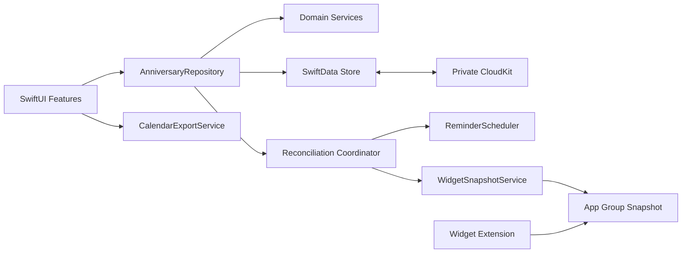

# Taisetsu 产品与技术设计

- 状态：已通过会话评审
- 日期：2026-08-03
- 平台：iOS / iPadOS
- 技术基线：SwiftUI、SwiftData、CloudKit、WidgetKit、UserNotifications、EventKit

## 1. 产品概述

Taisetsu 是一款本地优先的个人纪念日应用。用户可以记录公历或农历纪念日，设置重复周期、正计时或倒计时、多条提醒、分类和标签，并通过小组件查看最重要且距离当前最近的事件。

数据首先保存在本机，并通过用户自己的私人 CloudKit 数据库在设备间同步。产品不要求注册账号，也不依赖自建服务端。

## 2. 首版目标

首版必须支持：

- 纪念日的新增、查看、编辑和删除。
- 公历及农历日期，包括农历闰月。
- 全天事件和具有具体时、分的事件。
- 不重复、每周、每月、每年，以及每 N 天、周、月、年的重复规则。
- 每个纪念日独立选择倒计时、正计时或同时显示。
- 每个纪念日配置多条提醒。
- 单一分类与多个自由标签的组合管理。
- 首页与小组件共用的置顶规则。
- 搜索、分类筛选和标签筛选。
- 小号、中号和大号主屏幕小组件。
- 通过 iCloud 自动同步同一用户的设备。
- 单向导出并更新系统日历事件。
- 简体中文界面、系统地区格式、深色模式、动态字体和 VoiceOver。

## 3. 首版非目标

以下功能不进入首版：

- 自建账号、服务端或跨平台同步。
- 多人共享、协同编辑或公开纪念日。
- 从系统日历导入或双向同步。
- Apple Watch、Mac 专属界面、实时活动和锁屏倒计时。
- 复杂的自定义主题、照片背景或在线素材。
- 独立“分组”功能；分类和标签已经覆盖首版组织需求。
- 秒级小组件刷新。

## 4. 已确认的产品决策

### 4.1 数据与同步

- 本地优先，使用 SwiftData 保存主数据。
- 使用私人 CloudKit 数据库自动同步。
- 不注册账号；iCloud 不可用时应用仍可本地使用。
- 小组件不直接依赖完整主数据库，而是读取 App Group 中的派生快照。

### 4.2 首页

首页采用“最近优先”结构：

- 顶部主卡片显示最高优先级事件。
- 有置顶事件时，主卡片显示下一次发生时间最近的置顶事件。
- 多个置顶事件中，有下一次发生时间的事件优先并按时间排序；没有下一次发生时间的正计时事件随后按原始日期倒序排列。
- 未置顶事件随后按下一次发生时间排序。
- 没有未来发生时间的正计时事件进入“持续至今”区。
- 已结束且仅显示倒计时的事件进入“已结束”区。

`isPinned` 同时影响首页和小组件。`isVisibleInWidget` 只控制小组件可见性，因此置顶事件仍可以从小组件中排除。

首页提供搜索、分类筛选、标签筛选，以及添加、编辑、删除、置顶和取消置顶操作。

### 4.3 小组件

小组件按置顶及最近发生时间自动选取内容，同时允许用户隐藏单个纪念日。

- 小号方形：显示 1 个事件。
- 中号宽卡片：突出 1 个主事件，并显示随后 3 个事件。
- 大号方形：突出 1 个主事件，并显示随后 4 个事件；可以展示农历、周期及正计时补充信息。

### 4.4 分类与标签

- 每个纪念日拥有零个或一个分类。
- 每个纪念日拥有零个或多个标签。
- 应用提供家庭、爱情、生日、健康、工作等默认分类。
- 用户可以新增、改名、调整图标和颜色或隐藏分类。
- 标签完全自由创建，并提供输入联想与规范化去重。
- 组合筛选采用“所选分类 AND 所选标签”的语义；选择多个标签时，必须全部包含。
- 未选择分类的纪念日归入“未分类”。

### 4.5 提醒

- 每个纪念日可配置多条提醒。
- 一条提醒包含提前天数和提醒时刻。
- 对具有具体时间的事件，可以选择“事件发生时”。
- 通知权限在用户首次启用提醒时请求，不在应用首次启动时请求。

### 4.6 系统日历

- 用户主动触发单向导出。
- 首次导出时申请完整日历访问权限。
- 保存导出事件标识，后续导出更新原事件。
- 系统日历中的修改不反向覆盖 Taisetsu。
- 如果原事件已被删除，再次导出前提示用户并创建新事件。

## 5. 信息架构与用户流程

应用包含三个主页面。

### 5.1 首页“最近”

- 主卡片展示最高优先级事件。
- 下方按规则展示置顶、即将到来、持续至今和已结束事件。
- 搜索匹配名称、备注、分类和标签。
- 分类和标签筛选可以与搜索组合。
- 列表滑动操作提供编辑、置顶和删除；删除需要确认。

### 5.2 日历

- 月历展示当月纪念日分布。
- 农历事件使用目标年份计算出的实际公历日期落位。
- 点击日期展示当天全部事件。
- 月历属于次级浏览方式，不改变首页排序规则。

### 5.3 设置

- 管理分类和标签。
- 配置默认提醒建议值。
- 查看通知与日历权限状态。
- 查看 iCloud 同步状态与故障说明。
- 提供隐私、数据与应用信息入口。

### 5.4 新增与编辑

编辑器按以下顺序组织：

1. 基本信息：名称、备注、分类、标签、可选样式覆盖。
2. 日期：公历或农历、全天或具体时间。
3. 重复：不重复、标准周期或自定义间隔。
4. 显示：倒计时、正计时或同时显示。
5. 提醒：零到多条提醒规则。
6. 可见性：置顶状态与小组件可见性。

分类提供默认图标和颜色。纪念日可以覆盖分类样式；未覆盖时自动继承分类样式。

### 5.5 详情

详情页展示：

- 名称、分类、标签和备注。
- 原始日期及其公历或农历表达。
- 已经过多久和距离下一次还有多久。
- 重复规则和下一次发生时间。
- 提醒列表。
- 小组件与置顶状态。
- 编辑、删除和导出到系统日历操作。

## 6. 视觉与无障碍

视觉语言采用“原生克制”：

- 遵循系统导航、列表、表单、材质和交互习惯。
- 以留白和文字层级为主，分类颜色仅用于有限强调。
- 首页主卡片可以使用分类色派生的低饱和渐变。
- 不让颜色单独承担状态表达；始终配合图标或文字。
- 同时支持浅色和深色外观。
- 支持动态字体，包括辅助功能大字号。
- 所有核心控件具有 VoiceOver 标签、值和操作提示。
- 小组件标题和日期详情等敏感内容使用系统隐私遮罩能力。
- 减少动态效果设置开启时，不使用非必要动画。

## 7. 领域模型

### 7.1 Anniversary

主要字段：

- `id: UUID`
- `title: String`
- `notes: String?`
- `calendarKind: gregorian | chinese`
- `originalYear: Int`
- `originalMonth: Int`
- `originalDay: Int`
- `isLeapMonth: Bool`
- `isAllDay: Bool`
- `hour: Int?`
- `minute: Int?`
- `recurrenceUnit: none | day | week | month | year`
- `recurrenceInterval: Int`
- `displayMode: countdown | countUp | both`
- `isPinned: Bool`
- `isVisibleInWidget: Bool`
- `symbolOverride: String?`
- `colorOverride: String?`
- `category: Category?`
- `tags: [Tag]?`
- `reminders: [ReminderRule]?`
- `exportedCalendarEventIdentifier: String?`
- `createdAt: Date`
- `updatedAt: Date`

年份必须保留，因为正计时始终从最初纪念日计算。日期不能只保存为转换后的公历 `Date`，否则无法可靠保留农历、闰月和重复语义。

### 7.2 Category

- `id: UUID`
- `name: String`
- `normalizedName: String`
- `symbolName: String`
- `colorToken: String`
- `sortOrder: Int`
- `isHidden: Bool`
- `anniversaries: [Anniversary]?`

### 7.3 Tag

- `id: UUID`
- `name: String`
- `normalizedName: String`
- `anniversaries: [Anniversary]?`
- `createdAt: Date`

CloudKit 不能作为唯一约束的执行者。`normalizedName` 用于应用层去重，同步后的协调流程负责合并重复分类或标签。

### 7.4 ReminderRule

- `id: UUID`
- `daysBefore: Int`
- `hour: Int`
- `minute: Int`
- `firesAtEventTime: Bool`
- `isEnabled: Bool`
- `anniversary: Anniversary?`

`daysBefore` 必须大于或等于零。`firesAtEventTime` 仅对非全天事件生效。
当 `firesAtEventTime` 为真时忽略提醒规则自己的时、分。重复间隔必须大于或等于 1；不重复事件统一保存为间隔 1。

### 7.5 CloudKit 兼容约束

- 所有 SwiftData 关系按 CloudKit 要求设计为可选。
- 不依赖 `@Attribute(.unique)` 保证业务唯一性。
- 不使用 CloudKit 不支持的拒绝删除规则。
- 所有模型使用稳定 UUID。
- 上线后的 CloudKit Schema 只进行向前兼容、可迁移的增加。

## 8. 日期与重复计算

`OccurrenceCalculator` 是日期逻辑的唯一实现。首页、日历、小组件、提醒和日历导出必须调用同一接口。

输入包括纪念日、参考时间、当前时区和地区设置。输出包括：

- 原始发生时间。
- 上一次发生时间。
- 下一次发生时间。
- 已经过多久。
- 距离下一次还有多久。
- 当前展示状态及排序键。

### 8.1 计数规则

- 正计时始终从原始纪念日累计。
- 倒计时始终指向下一次发生时间。
- 未来的一次性事件使用正计时模式时显示“尚未开始”。
- 已过去的一次性事件使用倒计时模式时显示“已结束”。
- 全天事件按日历日边界计算天数，不用秒数除以 86400。
- 具体时间事件计算到小时和分钟。
- 时间采用浮动本地时间语义；用户跨时区后，09:00 仍表示当前位置的 09:00。

### 8.2 周期规则

- 每 N 天、周、月、年始终以原始日期为锚点。
- 不根据上次启动或上次提醒逐次累加，防止周期漂移。
- 标准每周、每月和每年是间隔为 1 的统一表示。

### 8.3 无效日期回落

- 公历 2 月 29 日在非闰年回落到 2 月 28 日。
- 每月 31 日遇到小月时回落到当月最后一天。
- 农历三十遇到只有二十九天的月份时回落到二十九。
- 原始日期属于农历闰月，但目标年份没有对应闰月时，回落到同编号的普通农历月份。
- 夏令时跳变造成目标时间不存在时，顺延到当天第一个有效时刻。

## 9. 架构

### 9.1 模块边界

- `Domain`：领域类型、日期计算、排序和校验规则。
- `Persistence`：SwiftData Schema、ModelContainer、迁移和 CloudKit 配置。
- `AnniversaryRepository`：唯一的业务读写入口。
- `ReminderScheduler`：本地通知授权、差异计算和调度。
- `WidgetSnapshotService`：生成并原子写入小组件快照。
- `CalendarExportService`：EventKit 授权、创建和更新。
- `Features`：Home、Calendar、Editor、Detail、Settings 界面与状态。

界面不能直接实现农历计算、通知调度或 CloudKit 逻辑。

### 9.2 组件关系



### 9.3 本地修改流程

```text
用户操作
  -> 输入校验
  -> SwiftData 保存成功
  -> 计算受影响的发生时间
  -> 更新本地通知
  -> 原子替换 WidgetSnapshot
  -> 请求 WidgetKit 更新时间线
  -> SwiftData 后台同步 CloudKit
```

所有外部副作用发生在数据库保存成功之后。通知、快照或日历导出失败时不回滚已经保存的纪念日。

### 9.4 协调流程

`ReconciliationCoordinator` 在以下时机运行：

- 应用启动。
- 应用进入前台。
- 本地数据保存后。
- 观察到 iCloud 合并后。
- 系统时区、地区或日历日期改变后。

协调流程负责：

- 重新计算下一次发生时间。
- 差异更新当前设备的通知请求。
- 重建小组件快照。
- 合并重复分类和标签。
- 清理失效的导出标识。
- 重试之前失败的派生操作。

## 10. iCloud 同步

- SwiftData 主库使用明确配置的私人 CloudKit 数据库。
- App Group 只存放派生的小组件快照，不作为业务主库。
- 本地保存不等待网络同步。
- iCloud 暂不可用时，应用继续读写本地数据。
- 设置页提供简化状态：已同步、同步中、暂不可用。
- 首版接受 SwiftData/CloudKit 的自动合并结果，不提供人工冲突编辑器。
- `updatedAt` 用于刷新派生数据和诊断，不承诺多人协作式版本历史。
- 同步后的分类和标签执行规范化去重。

实现前必须配置有效的 iCloud Container、App Group、主应用与 Widget Extension Entitlements，以及 CloudKit 生产 Schema 发布流程。

## 11. 本地提醒

### 11.1 调度

- 提醒规则随 SwiftData 同步。
- 系统中的待发送通知属于设备本地状态，不跨设备同步。
- 每台设备根据同步到的规则独立生成通知。
- 农历与自定义周期先通过 `OccurrenceCalculator` 转换为具体发生时间，再创建一次性通知请求。
- 对所有未来通知按触发时间排序，并使用滚动窗口调度最近的一批请求。
- 应用启动、进入前台、数据或时区变化时补充窗口。

### 11.2 稳定标识

通知请求标识由纪念日 ID、提醒规则 ID 和目标发生时间组成。修改纪念日时可以精确移除旧请求，删除纪念日时可以清理全部关联请求。

### 11.3 权限与失败

- 首次启用提醒时申请权限。
- 权限被拒绝时仍保存提醒规则，但标记为未生效。
- 设置页提供跳转系统设置的说明。
- 系统不保证本地通知绝对准时，界面不作超出平台能力的承诺。

## 12. 小组件快照

小组件使用版本化的只读快照，而不加载完整 SwiftData 主库。

`WidgetSnapshot` 包含：

- `schemaVersion`
- `generatedAt`
- 当前时区和地区标识
- 排序后的最多 5 个 `WidgetEventSnapshot`

每个事件快照只包含渲染所需字段：ID、标题、图标、颜色、下一次发生时间、正计时起点、显示模式、农历摘要、周期摘要和置顶状态。

快照写入使用临时文件加原子替换。写入失败时保留上一份有效快照。快照缺失或不可解析时，小组件显示“打开 Taisetsu 完成更新”。

Widget 时间线在以下边界准备更新：

- 本地午夜。
- 事件发生时刻。
- 展示单位从天切换到小时或分钟的关键点。
- 主应用明确请求刷新后。

WidgetKit 拥有最终调度权；不承诺秒级或严格逐分钟刷新。

## 13. 系统日历导出

- 仅在用户主动点击时访问 EventKit。
- 首次使用申请完整事件访问权限。
- 每次只把 Taisetsu 计算出的“下一次发生”导出为一个非重复系统日历事件，避免系统日历无法准确表达农历和部分回落规则。
- 创建系统日历事件后保存其标识。
- 再次导出时通过标识查找并把原事件更新到当前的下一次发生时间。
- 原事件不存在时，提示用户后创建新事件并更新标识。
- Taisetsu 不在后台自动改写系统日历；更新仍由用户再次点击导出触发。
- 用户撤销权限后，保留 Taisetsu 数据和导出标识，但不再访问日历。
- 从不扫描、导入或监听无关日历事件。
- 从不把系统日历修改反向写回 Taisetsu。

## 14. 错误处理

- 保存失败：保留编辑草稿并显示可操作错误。
- 日期无效：在字段附近指出原因，不静默猜测。
- iCloud 失败：继续本地使用，持续失败时在设置页提示。
- 通知失败：保存纪念日并记录待重试状态。
- 快照失败：继续使用上一份有效快照。
- 日历导出失败：只报告导出失败，不修改纪念日。
- 权限拒绝：解释受影响功能，并提供系统设置入口。
- 主库初始化失败：展示可恢复错误界面，禁止用 `fatalError` 终止正式版应用。

日志不得包含纪念日名称、备注或其他用户内容；只记录匿名标识、错误类型和时间。

## 15. 测试策略

测试策略由开发实现负责，并作为功能完成条件而非后续补充。

### 15.1 单元测试

`OccurrenceCalculator` 必须覆盖：

- 公历闰年与 2 月 29 日。
- 月末 29、30、31 日。
- 农历大小月、闰月及闰月回落。
- 每 N 天、周、月、年的锚点计算。
- 全天和具体时间。
- 正计时、倒计时和同时显示。
- 时区切换与夏令时跳变。
- 过去、现在和未来边界。

排序测试必须覆盖置顶、隐藏、无未来日期、分类和标签组合筛选。

### 15.2 服务测试

- Repository 的校验、保存、删除和回滚行为。
- SwiftData 内存或临时存储中的模型关系和迁移。
- 分类与标签的规范化去重。
- ReminderScheduler 的稳定标识和差异调度。
- WidgetSnapshot 的排序、容量、版本和原子替换。
- CalendarExportService 的首次创建、更新、事件缺失和权限撤销。

系统框架通过协议封装和测试替身验证业务行为；真机测试验证平台集成。

### 15.3 界面与无障碍测试

- 新增、编辑、删除、搜索、筛选、置顶和导出主流程。
- 权限允许、拒绝和撤销状态。
- 空状态、错误状态及长文本。
- 小号、中号和大号小组件。
- 浅色、深色、辅助功能大字号和 VoiceOver。

### 15.4 同步与真机测试

- 至少两个真实设备或隔离测试环境之间的 iCloud 同步。
- 离线创建后重新联网。
- 两端先后修改同一纪念日。
- 新设备同步后重建通知与小组件。
- Widget 离开 Xcode 调试器后的实际更新时间线。
- 通知、日历和 iCloud 权限被拒绝时的数据完整性。

### 15.5 性能验证

- 使用至少 1,000 条纪念日生成首页、筛选结果和小组件快照。
- 日期批量计算不得阻塞主线程。
- Widget Extension 不加载不必要的业务对象或网络资源。
- 通过 Instruments 检查首页滚动、启动、内存和 SwiftData 查询。

## 16. 首版验收条件

1. 用户可以完整增删改查公历和农历纪念日。
2. 自定义周期、正计时和下一次倒计时结果符合本文规则。
3. 多条提醒可以创建、修改、取消，并在每台设备独立恢复。
4. 首页、日历、提醒和小组件使用同一日期计算结果。
5. 置顶、分类、标签、搜索和小组件隐藏可以组合使用。
6. 小号、中号和大号小组件正确展示 1、4、5 个事件。
7. 数据可以通过私人 CloudKit 在用户设备间同步。
8. 系统日历导出可以创建和更新，且不会反向同步。
9. 通知、日历或 iCloud 权限被拒绝时不崩溃、不丢失纪念日。
10. 深色模式、动态字体和 VoiceOver 可以完成核心流程。
11. 使用 1,000 条测试数据时，首页计算不阻塞主线程。

## 17. 参考资料

- [SwiftData ModelConfiguration](https://developer.apple.com/documentation/swiftdata/modelconfiguration)
- [SwiftData 跨设备同步](https://developer.apple.com/documentation/swiftdata/syncing-model-data-across-a-persons-devices)
- [WidgetKit WidgetFamily](https://developer.apple.com/documentation/widgetkit/widgetfamily/)
- [WidgetKit 数据共享策略](https://developer.apple.com/documentation/WidgetKit/Developing-a-WidgetKit-strategy)
- [WidgetKit 时间线更新](https://developer.apple.com/documentation/widgetkit/keeping-a-widget-up-to-date)
- [UserNotifications 本地通知](https://developer.apple.com/documentation/usernotifications/scheduling-a-notification-locally-from-your-app)
- [EventKit 事件权限](https://developer.apple.com/documentation/eventkit/ekeventstore/requestfullaccesstoevents%28completion%3A%29)
